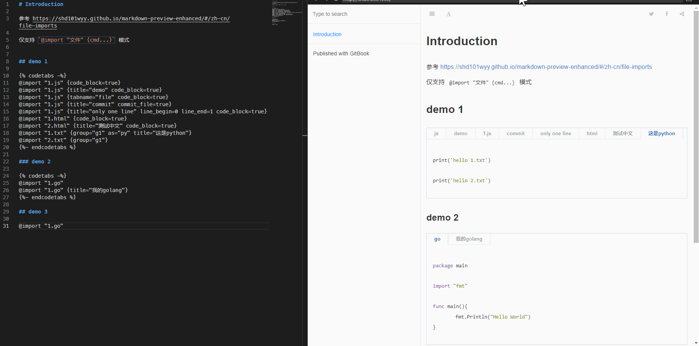

# gitbook-plugin-gbook-codetabs

- 目的，当然尽可能复用文件中的代码，不用复制粘贴反复修改
- 为了尽量和 vscode markdown-preview-enhanced 插件 @import 一致而开发 
  - 参考 https://shd101wyy.github.io/markdown-preview-enhanced/#/zh-cn/file-imports
  - 仅支持 `@import "文件" {cmd...}` 模式
  - 支持其大部分特性，详见示例
  - 支持大部分代码块展示
- 整合 import 及 codetab 插件，修复了一些bug
- 如果感觉不错请给 https://github.com/q9090960bnb3/gitbook-plugin-gbook-codetabs 点个小星星吧，谢谢
- codetabs 特性
  - {tabname="file"} tab名称显示为 文件名
  - {title="xxx"} tab名称显示为 设置名称
  - {group="xx"} 将多个代码块整合在一个tab 中，其他信息以第一个group 代码块为准
  - {commit_file=true} 首行以注释方式显示文件名
  - 也支持手写代码块(非@import方式)
- 其他兼容性请自行测试
## how to use

````md
## demo 1


@import "1.js" {code_block=true}
@import "1.js" {title="demo" code_block=true}
@import "1.js" {tabname="file" code_block=true}
@import "1.js" {title="commit" commit_file=true}
@import "1.js" {title="only one line" line_begin=0 line_end=1 code_block=true}
@import "1.html" {code_block=true}
@import "2.html" {title="测试中文" code_block=true}
@import "1.txt" {group="g1" as="py" title="这是python"}
@import "2.txt" {group="g1"}


### demo 2


@import "1.go"
@import "1.go" {title="我的golang"}


## demo 3

@import "1.go"

````

## use in book.json

```json
{
  "plugins": ["gbook-codetabs"]
}
```

## display



## thanks

[plugin-codetabs](https://github.com/GitbookIO/plugin-codetabs.git)
[gitbook-plugin-prism-codetab-fox](https://www.npmjs.com/package/gitbook-plugin-prism-codetab-fox)